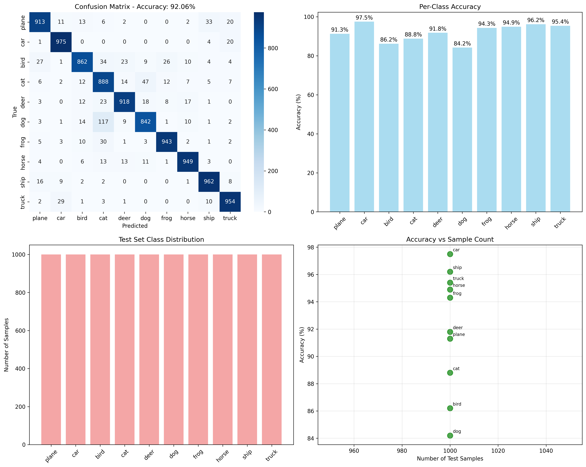
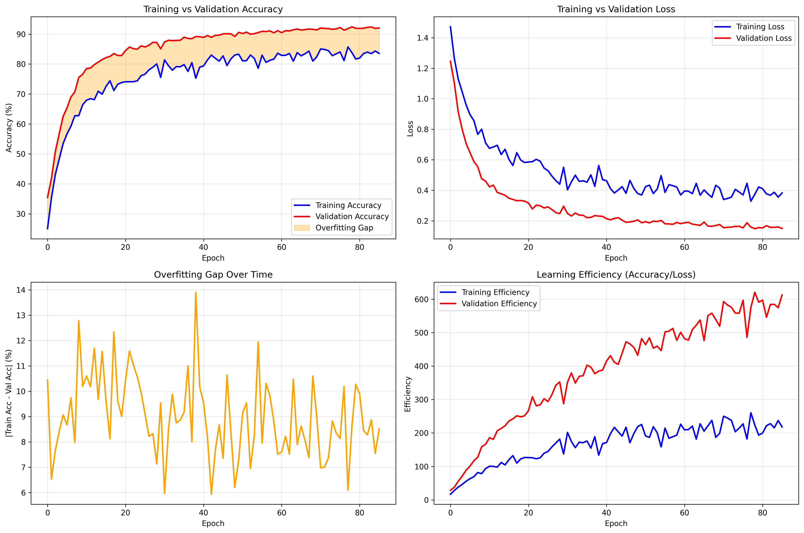

# CIFAR-10 CNN Classification with PyTorch

A comprehensive deep learning project implementing and comparing two CNN architectures for CIFAR-10 image classification, featuring advanced training techniques and thorough performance analysis.

## 🎯 Project Overview

This project implements two distinct CNN architectures to classify images from the CIFAR-10 dataset:

- **Simple CNN**: A straightforward 3-layer convolutional network
- **Improved CNN**: An advanced architecture with residual blocks, progressive dropout, and regularization techniques

The project includes comprehensive evaluation metrics, overfitting analysis, and visualization tools to compare model performance.

## 📊 Dataset

**CIFAR-10** consists of 60,000 32x32 color images in 10 classes:

- ✈️ Airplane, 🚗 Car, 🐦 Bird, 🐱 Cat, 🦌 Deer
- 🐕 Dog, 🐸 Frog, 🐴 Horse, 🚢 Ship, 🚛 Truck

- **Training set**: 50,000 images
- **Test set**: 10,000 images

## 🏗️ Model Architectures

### Simple CNN (`CNN_simple.py`)

- 3 convolutional layers (32 → 64 → 128 channels)
- Batch normalization and dropout for regularization
- MaxPooling for dimensionality reduction
- Fully connected layers for classification

### Improved CNN (`CNN_improved.py`)

- **Residual blocks** for better gradient flow
- **Progressive dropout** strategy (0.05 → 0.5)
- **Global Average Pooling** to reduce parameters
- **Enhanced regularization** to combat overfitting
- **Adaptive learning** with cosine annealing

## 🔧 Key Features

### Advanced Training Techniques

- **Combined Loss Function**: Focal Loss + Label Smoothing Cross Entropy
- **Data Augmentation**: Random flips, rotations, color jittering
- **Progressive Dropout**: Dynamic dropout rates during training
- **Cosine Annealing**: Learning rate scheduling

### Comprehensive Evaluation

- Training/validation loss and accuracy tracking
- Confusion matrix analysis
- Per-class performance metrics
- Overfitting detection and analysis

## 📈 Results & Analysis

### Performance Comparison



*Latest comprehensive evaluation showing training progress, validation metrics, and final test accuracy for both models.*

### Overfitting Analysis



*Analysis of training vs validation performance to detect and measure overfitting in both architectures.*

## 🚀 Getting Started

### Prerequisites

```bash
pip install -r requirements.txt
```

### Required Dependencies

- PyTorch ≥ 2.0.0
- torchvision ≥ 0.15.0
- matplotlib ≥ 3.5.0
- seaborn ≥ 0.11.0
- scikit-learn ≥ 1.0.0
- tqdm ≥ 4.60.0

### Running the Project

**Train and evaluate models:**

```python
python cifar10_main.py
```

## 📁 Project Structure

```text
CIFAR-10/
├── cifar10_main.py           # Main training and evaluation script
├── cifar10_colab.py          # Google Colab optimized version
├── CNN_simple.py             # Simple CNN architecture
├── CNN_improved.py           # Advanced CNN with residual blocks
├── colab_git_training.py     # Colab git integration
├── requirements.txt          # Project dependencies
├── data/                     # CIFAR-10 dataset storage
├── *.png                     # Generated evaluation plots
└── README.md                 # This file
```

## 🎯 Key Results

The improved CNN architecture demonstrates:

- **Better generalization** through residual connections
- **Reduced overfitting** via progressive dropout
- **Improved convergence** with advanced loss functions
- **Enhanced performance** on challenging classes (cats, birds, dogs)

## 🔬 Technical Highlights

- **Smart Loss Function**: Combines Focal Loss for hard examples with Label Smoothing for better generalization
- **Adaptive Training**: Dynamic dropout rates and learning rate scheduling
- **Comprehensive Analysis**: Detailed overfitting detection and per-class performance metrics
- **Production Ready**: Clean, modular code with proper documentation

## 📝 License

This project is open source and available under the MIT License.